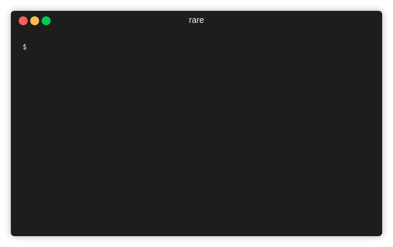

# rare

 [](https://codecov.io/gh/zix99/rare)


A file scanner/regex extractor and realtime summarizor.

Supports various CLI-based graphing and metric formats (histogram, table, etc).



# Features

 * Multiple summary formats including: filter (like grep), histogram, and numerical analysis
 * File glob expansions (eg `/var/log/*` or `/var/log/*/*.log`) and `-R`
 * Optional gzip decompression (with `-z`)
 * Following `-f` or re-open following `-F` (use `--poll` to poll)
 * Ignoring lines that match an expression
 * Aggregating and realtime summary (Don't have to wait for all data to be scanned)
 * Multi-threaded reading, parsing, and aggregation
 * Color-coded outputs (optionally)
 * Pipe support (stdin for reading, stdout will disable color) eg. `tail -f | rare ...`

# Installation

**Notes on versions:**  Besides your standard OS versions, there is an additional `pcre` build which is 4x faster than go's `re2` implementation.  In order to use this, you must make sure that libpcre2 is installed.  Right now, it is only bundled with the linux distribution.

## Manual

Download appropriate binary from [Releases](https://github.com/zix99/rare/releases), unzip, and put it in `/bin`

## Homebrew

```sh
brew tap zix99/rare
brew install rare
```

## From code

Clone the repo, and:

Requires GO 1.11 or higher (Uses go modules)

```sh
go get ./...

# Pack documentation (Only necessary for release builds)
go run github.com/gobuffalo/packr/v2/packr2

# Build binary
go build .

# OR, with experimental features
go build -tags experimental .
```

Available tags:

* `experimental` Enable experimental features (eg. fuzzy search)
* `pcre1` Enables PCRE 1 (v8) where able
* `pcre2` Enables PCRE 2 (v10) where able

# Docs

All documentation may be found here, in the [docs/](docs/) folder, and by running `rare docs` (embedded docs/ folder)

You can also see a dump of the CLI options at [cli-help.md](cli-help.md)

# Example

## Extract status codes from nginx logs

```sh
$ rare histo -m '"(\w{3,4}) ([A-Za-z0-9/.]+).*" (\d{3})' -e '{3} {1}' access.log
200 GET                          160663
404 GET                          857
304 GET                          53
200 HEAD                         18
403 GET                          14
```

## Extract number of bytes sent by bucket, and format

This shows an example of how to bucket the values into size of `1000`. In this case, it doesn't make
sense to see the histogram by number of bytes, but we might want to know the ratio of various orders-of-magnitudes.

```sh
$ rare histo -m '"(\w{3,4}) ([A-Za-z0-9/.]+).*" (\d{3}) (\d+)' -e "{bucket {4} 10000}" -n 10 access.log -b
0                   144239     ||||||||||||||||||||||||||||||||||||||||||||||||||
190000              2599       
10000               1290       
180000              821        
20000               496        
30000               445        
40000               440        
200000              427        
140000              323        
70000               222        
Matched: 161622 / 161622
Groups:  1203
```

# Output Formats

## Histogram (histo)

The histogram format outputs an aggregation by counting the occurences of an extracted match.  That is to say, on every line a regex will be matched (or not), and the matched groups can be used to extract and build a key, that will act as the bucketing name.

```
NAME:
   rare histogram - Summarize results by extracting them to a histogram

USAGE:
   rare histogram [command options] <-|filename|glob...>

DESCRIPTION:
   Generates a live-updating histogram of the extracted information from a file
    Each line in the file will be matched, any the matching part extracted
    as a key and counted.
    If an extraction expression is provided with -e, that will be used
    as the key instead

OPTIONS:
   --follow, -f                 Read appended data as file grows
   --reopen, -F                 Same as -f, but will reopen recreated files
   --poll                       When following a file, poll for changes rather than using inotify
   --posix, -p                  Compile regex as against posix standard
   --match value, -m value      Regex to create match groups to summarize on (default: ".*")
   --extract value, -e value    Expression that will generate the key to group by (default: "{0}")
   --gunzip, -z                 Attempt to decompress file when reading
   --batch value                Specifies io batching size. Set to 1 for immediate input (default: 1000)
   --workers value, -w value    Set number of data processors (default: 5)
   --readers value, --wr value  Sets the number of concurrent readers (Infinite when -f) (default: 3)
   --ignore value, -i value     Ignore a match given a truthy expression (Can have multiple)
   --recursive, -R              Recursively walk a non-globbing path and search for plain-files
   --bars, -b                   Display bars as part of histogram
   --num value, -n value        Number of elements to display (default: 5)
   --reverse                    Reverses the display sort-order
   --sortkey, --sk              Sort by key, rather than value

```

## Filter (filter)

Filter is a command used to match and (optionally) extract that match without any aggregation. It's effectively a `grep` or a combination of `grep`, `awk`, and/or `sed`.

```
NAME:
   rare filter - Filter incoming results with search criteria, and output raw matches

USAGE:
   rare filter [command options] <-|filename|glob...>

DESCRIPTION:
   Filters incoming results by a regex, and output the match or an extracted expression.
    Unable to output contextual information due to the application's parallelism.  Use grep if you
    need that

OPTIONS:
   --follow, -f                 Read appended data as file grows
   --reopen, -F                 Same as -f, but will reopen recreated files
   --poll                       When following a file, poll for changes rather than using inotify
   --posix, -p                  Compile regex as against posix standard
   --match value, -m value      Regex to create match groups to summarize on (default: ".*")
   --extract value, -e value    Expression that will generate the key to group by (default: "{0}")
   --gunzip, -z                 Attempt to decompress file when reading
   --batch value                Specifies io batching size. Set to 1 for immediate input (default: 1000)
   --workers value, -w value    Set number of data processors (default: 5)
   --readers value, --wr value  Sets the number of concurrent readers (Infinite when -f) (default: 3)
   --ignore value, -i value     Ignore a match given a truthy expression (Can have multiple)
   --recursive, -R              Recursively walk a non-globbing path and search for plain-files
   --line, -l                   Output line numbers
```

## Numerical Analysis

This command will extract a number from logs and run basic analysis on that number (Such as mean, median, mode, and quantiles).

```
NAME:
   rare analyze - Numerical analysis on a set of filtered data

USAGE:
   rare analyze [command options] <-|filename|glob...>

DESCRIPTION:
   Treat every extracted expression as a numerical input, and run analysis
    on that input.  Will extract mean, median, mode, min, max.  If specifying --extra
    will also extract std deviation, and quantiles

OPTIONS:
   --follow, -f                 Read appended data as file grows
   --reopen, -F                 Same as -f, but will reopen recreated files
   --poll                       When following a file, poll for changes rather than using inotify
   --posix, -p                  Compile regex as against posix standard
   --match value, -m value      Regex to create match groups to summarize on (default: ".*")
   --extract value, -e value    Expression that will generate the key to group by (default: "{0}")
   --gunzip, -z                 Attempt to decompress file when reading
   --batch value                Specifies io batching size. Set to 1 for immediate input (default: 1000)
   --workers value, -w value    Set number of data processors (default: 5)
   --readers value, --wr value  Sets the number of concurrent readers (Infinite when -f) (default: 3)
   --ignore value, -i value     Ignore a match given a truthy expression (Can have multiple)
   --recursive, -R              Recursively walk a non-globbing path and search for plain-files
   --extra                      Displays extra analysis on the data (Requires more memory and cpu)
   --reverse, -r                Reverses the numerical series when ordered-analysis takes place (eg Quantile)
   --quantile value, -q value   Adds a quantile to the output set. Requires --extra (default: "90", "99", "99.9")
```

**Example:**

```bash
$ go run *.go --color analyze -m '"(\w{3,4}) ([A-Za-z0-9/.@_-]+).*" (\d{3}) (\d+)' -e "{4}" testdata/access.log 
Samples:  161,622
Mean:     2,566,283.9616
Min:      0.0000
Max:      1,198,677,592.0000

Median:   1,021.0000
Mode:     1,021.0000
P90:      19,506.0000
P99:      64,757,808.0000
P99.9:    395,186,166.0000
Matched: 161,622 / 161,622
```

## Tabulate

Create a 2D view (table) of data extracted from a file. Expression needs to yield a two dimensions separated by a tab.  Can either use `\x00` or the `{$ a b}` helper.  First element is the column name, followed by the row name.

```
NAME:
   rare tabulate - Create a 2D summarizing table of extracted data

USAGE:
   rare tabulate [command options] <-|filename|glob...>

DESCRIPTION:
   Summarizes the extracted data as a 2D data table.
    The key is provided in the expression, and should be separated by a tab \x00
    character or via {$ a b} Where a is the column header, and b is the row

OPTIONS:
   --follow, -f                 Read appended data as file grows
   --reopen, -F                 Same as -f, but will reopen recreated files
   --poll                       When following a file, poll for changes rather than using inotify
   --posix, -p                  Compile regex as against posix standard
   --match value, -m value      Regex to create match groups to summarize on (default: ".*")
   --extract value, -e value    Expression that will generate the key to group by (default: "{0}")
   --gunzip, -z                 Attempt to decompress file when reading
   --batch value                Specifies io batching size. Set to 1 for immediate input (default: 1000)
   --workers value, -w value    Set number of data processors (default: 5)
   --readers value, --wr value  Sets the number of concurrent readers (Infinite when -f) (default: 3)
   --ignore value, -i value     Ignore a match given a truthy expression (Can have multiple)
   --recursive, -R              Recursively walk a non-globbing path and search for plain-files
   --delim value                Character to tabulate on. Use {$} helper by default (default: "\x00")
   --num value, -n value        Number of elements to display (default: 20)
   --cols value                 Number of columns to display (default: 10)
   --sortkey, --sk              Sort rows by key name rather than by values
```

**Example:**

```bash
$ rare tabulate -m "(\d{3}) (\d+)" -e "{$ {1} {bucket {2} 100000}}" -sk access.log

         200      404      304      403      301      206      
0        153,271  860      53       14       12       2                 
1000000  796      0        0        0        0        0                 
2000000  513      0        0        0        0        0                 
7000000  262      0        0        0        0        0                 
4000000  257      0        0        0        0        0                 
6000000  221      0        0        0        0        0                 
5000000  218      0        0        0        0        0                 
9000000  206      0        0        0        0        0                 
3000000  202      0        0        0        0        0                 
10000000 201      0        0        0        0        0                 
11000000 190      0        0        0        0        0                 
21000000 142      0        0        0        0        0                 
15000000 138      0        0        0        0        0                 
8000000  137      0        0        0        0        0                 
22000000 123      0        0        0        0        0                 
14000000 121      0        0        0        0        0                 
16000000 110      0        0        0        0        0                 
17000000 99       0        0        0        0        0                 
34000000 91       0        0        0        0        0                 
Matched: 161,622 / 161,622
Rows: 223; Cols: 6
```

# Performance Benchmarking

I know there are different solutions, and rare accomplishes summarization in a way
that grep, awk, etc can't, however I think it's worth analyzing the performance of this
tool vs standard tools to show that it's at least as good.

It's worth noting that in many of these results rare is just as fast, but part
of that reason is that it consumes CPU in a more efficient way (go is great at parallelization).
So take that into account, for better or worse.

All tests were done on ~200MB of gzip'd nginx logs spread acorss 10 files.

Each program was run 3 times and the last time was taken (to make sure things were cached equally).

## zcat & grep

```
$ time zcat testdata/* | grep -Poa '" (\d{3})' | wc -l
1131354

real	0m0.990s
user	0m1.480s
sys	0m0.080s

$ time zcat testdata/* | grep -Poa '" 200' > /dev/null

real	0m1.136s
user	0m1.644s
sys	0m0.044s
```

I believe the largest holdup here is the fact that zcat will pass all the data to grep via a synchronous pipe, whereas
rare can process everything in async batches.  Using `pigz` instead didn't yield different results, but on single-file
results they did perform comparibly.

## Silver Searcher (ag)

```
$ ag --version
ag version 0.31.0

Features:
  +jit +lzma +zlib

$ time ag -z '" (\d{3})' testdata/* | wc -l
1131354

real	0m3.944s
user	0m3.904s
sys	0m0.152s
```

## rare

```
$ rare -v
rare version 0.1.16, 11ca2bfc4ad35683c59929a74ad023cc762a29ae

$ time rare filter -m '" (\d{3})' -e "{1}" -z testdata/* | wc -l
Matched: 1,131,354 / 3,638,594
1131354

real	0m0.927s
user	0m1.764s
sys	0m1.144s

$ time rare histo -m '" (\d{3})' -e "{1}" -z testdata/*
200                 1,124,767 
404                 6,020     
304                 371       
403                 98        
301                 84        

Matched: 1,131,354 / 3,638,594
Groups:  6

real	0m0.284s
user	0m1.648s
sys	0m0.048s
```

# Development

New additions to `rare` should pass the following checks

- Documentation for any new functionality or expression changes
- Before and after CPU and memory benchmarking for core additions (Expressions, aggregation, benchmarking, and rendering)
- Limit memory allocations (preferably 0!) in the high-throughput functions
- Tests, and if it makes sense, benchmarks of a given function

## Running/Testing

```bash
go run .
go test ./...
```

## Profiling

New high-throughput changes should be performance benchmarked.

To Benchmark:

```bash
go run . --profile out <your test code>
go tool pprof -http=:8080 out.cpu.prof # CPU
go tool pprof -http=:8080 out_num.prof # Memory
```

# License

    Copyright (C) 2019  Christopher LaPointe

    This program is free software: you can redistribute it and/or modify
    it under the terms of the GNU General Public License as published by
    the Free Software Foundation, either version 3 of the License, or
    (at your option) any later version.

    This program is distributed in the hope that it will be useful,
    but WITHOUT ANY WARRANTY; without even the implied warranty of
    MERCHANTABILITY or FITNESS FOR A PARTICULAR PURPOSE.  See the
    GNU General Public License for more details.

    You should have received a copy of the GNU General Public License
    along with this program.  If not, see <https://www.gnu.org/licenses/>.
