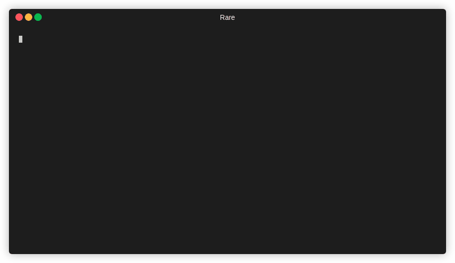

# rare

[](https://github.com/zix99/rare/actions)
[](https://github.com/zix99/rare/releases)
[](https://codecov.io/gh/zix99/rare)


A fast text scanner/regex extractor and realtime summarizer.

Supports various CLI-based graphing and metric formats (filter (grep-like), histogram, table, bargraph, etc).

`rare` is a play on "more" and "less", but can also stand for "realtime aggregated regular expressions".



## Features

 * Multiple summary formats including: filter (like grep), histogram, bar graphs, and numerical analysis
 * File glob expansions (eg `/var/log/*` or `/var/log/*/*.log`) and `-R`
 * Optional gzip decompression (with `-z`)
 * Following `-f` or re-open following `-F` (use `--poll` to poll, and `--tail` to tail)
 * Ignoring lines that match an expression (with `-i`)
 * Aggregating and realtime summary (Don't have to wait for all data to be scanned)
 * Multi-threaded reading, parsing, and aggregation (It's fast)
 * Color-coded outputs (optionally)
 * Pipe support (stdin for reading, stdout will disable color) eg. `tail -f | rare ...`

Take a look at [examples](usage/examples.md) to see more of what *rare* does.

## Installation

!!! note "A Note on PCRE (Perl Compatible Regex Library)"

    Besides your standard OS versions, there is an additional `pcre` build which is ~4x faster than go's `re2` implementation in moderately complex cases.  In order to use this, you must make sure that **libpcre2** is installed (eg `apt install libpcre2-8-0`).  Right now, it is only bundled with the linux distribution.

    PCRE2 also comes with pitfalls, two of the most important are:
    1. That *rare* is now dynamically linked, meaning that you need to have libc and libpcre installed
    2. That pcre is an exponential-time algorithm (re2 is linear).  While it can be significantly faster than go's `re2`, it can also be catastropically slower in some situations. There is a good post [here](https://swtch.com/~rsc/regexp/regexp1.html) that talks about regexp timings.

    I will leave it up to the user as to which they find suitable to use for their situation.  Generally, if you know what *rare* is getting as an input, the pcre version is perfectly safe and can be much faster.

### Manual

Download appropriate binary or package from [Releases](https://github.com/zix99/rare/releases)

### Homebrew

```sh
brew tap zix99/rare
brew install rare
```

### Community Contributed

!!! note
    The below install methods have been contributed by the community, and aren't maintained directly.

#### MacPorts

```sh
sudo port selfupdate
sudo port install rare
```

### From code

Clone the repo, and:

Requires GO 1.17 or higher

```sh
go mod download

# Build binary
go build .

# OR, with experimental features
go build -tags experimental .
```

Available tags:

* `experimental` Enable experimental features (eg. fuzzy search)
* `pcre2` Enables PCRE 2 (v10) where able. Currently linux only


## Quickstart

The easiest way to start using *rare* is by creating a `histogram`.

Each execution is usually composed of two parts, the [regex extracted match](usage/extractor.md) (`-m`) and the [expression](usage/expressions.md) (`-e`).

```sh
$ rare histo \
    -m '"(\w{3,4}) ([A-Za-z0-9/.]+).*" (\d{3})' \ # The regex that extracts match-groups
    -e '{3} {1}' \ # The expression will be the key, referencing the match-groups
    access.log     # One or more files (or -R for recursion)

200 GET                          160663
404 GET                          857
304 GET                          53
200 HEAD                         18
403 GET                          14
```

## Next

To learn more, check out the [aggregators](usage/aggregators.md), read some [examples](usage/examples.md) or dig into the [overview](usage/overview.md).
