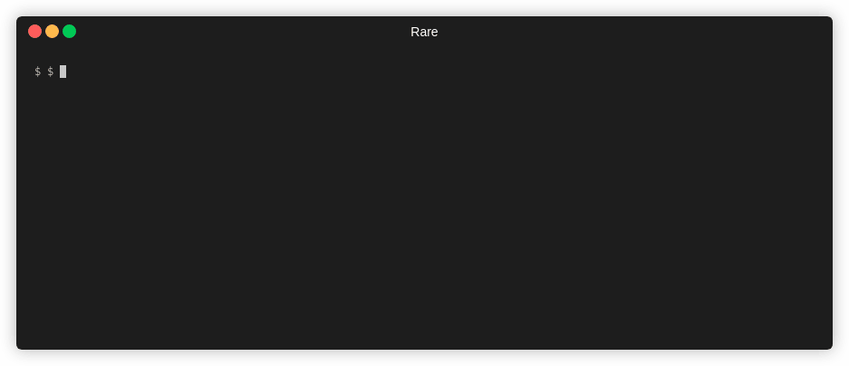
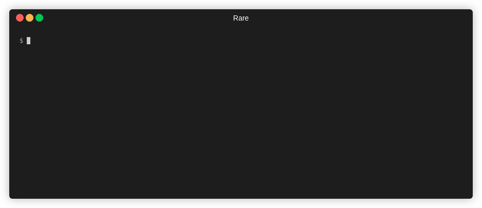
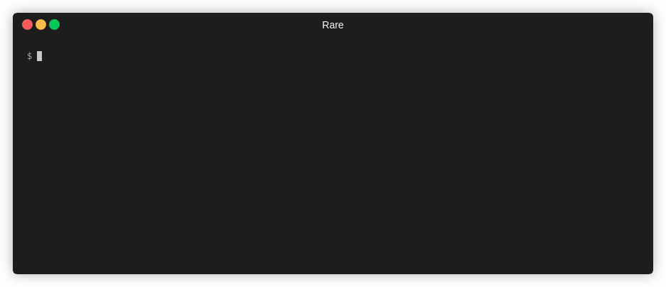
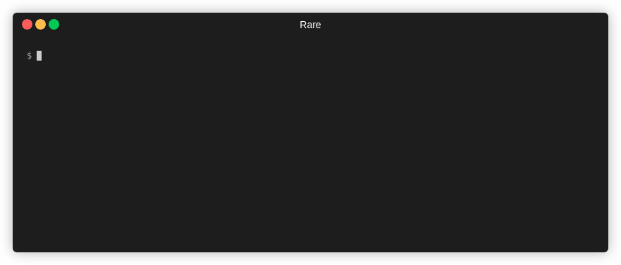

# Aggregators

*Aggregators* represent different ways to count and output data as it is processed
in *rare*. Aggregation takes in different formats of the [matched](extractor.md)
and extracted [expression](expressions.md), and either counts or analyzes the values.

!!! tip "More Examples"
    More examples of each can be found in [examples](examples.md). For CLI documentation, run `rare help`

## Filter

```sh
rare help filter
```

### Summary

Filter is a command used to match and (optionally) extract that match without
any aggregation. It's effectively a `grep` or a combination of `grep`, `awk`,
and/or `sed`.

### Example

Extract out two numbers from `access.log`

```
$ rare filter -n 4 -m "(\d{3}) (\d+)" -e "{1} {2}" access.log
404 169
404 169
404 571
404 571
Matched: 4 / 4
```




## Histogram

```sh
rare help histogram
```

### Summary

The histogram format outputs an aggregation by counting the occurences
of an extracted match.  That is to say, on every line a regex will be
matched (or not), and the matched groups can be used to extract and build
a key, that will act as the bucketing name.

### Example

Extract HTTP verb, URL and status code.  Key off of status code and verb.

!!! tip
    Use `-x` to display percentages and a simple bargraph.

```sh
$ rare histo -m '"(\w{3,4}) ([A-Za-z0-9/.]+).*" (\d{3})' -e '{3} {1}' access.log
200 GET                          160663
404 GET                          857
304 GET                          53
200 HEAD                         18
403 GET                          14
```


## Bar Graph

```sh
rare help bargraph
```

### Summary

Similar to histogram or table, bargraph can generate a stacked or grouped
bargraph by one or two keys.

### Example

!!! note "Color Coded Keys"
    When run in terminal, below will be color-coded keys. Alternatively, you can leave
    off `-s` (stacking) to see each key displayed vertically.

```
$ rare bars -sz -m "\[(.+?)\].*\" (\d+)" \
    -e "{$ {buckettime {1} year nginx} {bucket {2} {multi 10 10}}}" \
    testdata/*

        █ 200  █ 400  █ 300
2019  ████████████████████████████████████████  3,741,444
2020  █████████████████████████████████████████████████  4,631,884
Matched: 8,373,328 / 8,383,717
```


## Numerical Analysis

```sh
rare help analyze
```

### Summary

This command will extract a number from the match and run basic analysis on that
number (Such as mean, median, mode, and quantiles).

### Example

!!! note
    `-x` or `--extra` will capture more information (Median, Mode, and Percentiles),
    but dramatically slows down the analysis.

```bash
$ rare analyze --extra \
    -m '"(\w{3,4}) ([A-Za-z0-9/.@_-]+).*" (\d{3}) (\d+)' \
    -e "{4}" testdata/access.log

Samples:  161,622
Mean:     2,566,283.9616
Min:      0.0000
Max:      1,198,677,592.0000

Median:   1,021.0000
Mode:     1,021.0000
P90:      19,506.0000
P99:      64,757,808.0000
P99.9:    395,186,166.0000
Matched: 161,622 / 161,622
```



## Table

```sh
rare help table
```

### Summary

Create a 2D view (table) of data extracted from a file. Expression needs to
yield a two dimensions.  Can either use `\x00` or the `{$ a b}` helper.  First
element is the column name, followed by the row name.

### Example

```bash
$ rare tabulate -m "(\d{3}) (\d+)" \
    -e "{$ {1} {bucket {2} 100000}}" -sk access.log

         200      404      304      403      301      206      
0        153,271  860      53       14       12       2                 
1000000  796      0        0        0        0        0                 
2000000  513      0        0        0        0        0                 
7000000  262      0        0        0        0        0                 
4000000  257      0        0        0        0        0                 
6000000  221      0        0        0        0        0                 
5000000  218      0        0        0        0        0                 
9000000  206      0        0        0        0        0                 
3000000  202      0        0        0        0        0                 
10000000 201      0        0        0        0        0                 
11000000 190      0        0        0        0        0                 
21000000 142      0        0        0        0        0                 
15000000 138      0        0        0        0        0                 
8000000  137      0        0        0        0        0                 
22000000 123      0        0        0        0        0                 
14000000 121      0        0        0        0        0                 
16000000 110      0        0        0        0        0                 
17000000 99       0        0        0        0        0                 
34000000 91       0        0        0        0        0                 
Matched: 161,622 / 161,622
Rows: 223; Cols: 6
```



## Heatmap

```sh
rare help heatmap
```

### Summary

Create a dense, color-coded, version of table-data by using cells to display
the strength of a value. Can either use `\x00` or the `{$ a b}` helper.  First
element is the column name, followed by the row name.

### Example

```bash
$ rare heatmap -m '\[(.+?)\].*" (\d+)' \
    -e "{timeattr {time {1}} yearweek}" -e "{2}" access.log

        - 0    5 22,602    9 45,204
     2019-34..2019-41..2019-50..2020-15..2020-23..2020-31...2020-9
200  1111111111111111111111111111111111111111111111111111111-11111
206  -------------------------------------------------------------
301  -------------------------------------------------------------
304  -------------------------------------------------------------
400  -------------------------------------------------------------
404  33516265914153253212111-1511-13-141-1412-132111--14-1-1-13211
405  -------------------------------------------------------------
408  -------------------------------------------------------------
Matched: 1,035,666 / 1,035,666 (R: 8; C: 61)
```


